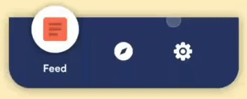

# **Beauty Navigation**



A beautiful navigation bar to use in flutter
Inspired from the *#dribbble* shot by [**Mauricio Bucardo**](dribbble.com/maubucardo)
[@m.bucardo](instagram.com/m.burcardo)


## Usage

#### **Add the Package in pubspec.yaml**

```yaml
dev_dependencies:
  flutter_test:
    sdk: flutter
  beauty_navigation: any
```

#### **Import the Package in your dart file**
```dart
import 'package:beauty_navigation/beauty_navigation.dart';
```
#### **Add the Widget to Bottom Navigation bar in Scaffold**
**NOTE: Minimum Items is 2 and Maximum is 4 in-order to keep the bar Beautiful**

```dart
return Scaffold(
        body: Container(),
        bottomNavigationBar: BeautyNavigation(
          items: <Items>[
            Items(
              icon: Icon(Icons.airline_seat_flat),
              tabName: 'Sleep',
              onClick: () {
                print('Sleep');
              },
            ),
            Items(
              icon: Icon(Icons.wifi_tethering),
              tabName: 'Wifi',
              onClick: () {
                print('Wifi');
              },
            ),
            Items(
              icon: Icon(Icons.adjust),
              tabName: 'Adjust',
              onClick: () {
                print('Adjust');
              },
            ),
            Items(
              icon: Icon(Icons.cake),
              tabName: 'Cake',
              onClick: () {
                print('Cake');
              },
            )
          ],
        ));
```

#### **More Options to customize the navigation bar**
*All the values below are **default***

```dart
bottomNavigationBar: BeautyNavigation(
          activeIconColor: Colors.deepOrangeAccent,
          inactiveIconColor: Colors.white,
          animationDuration: Duration(milliseconds: 500),
          circleColor: Colors.white,
          backgroundColor: Colors.indigo,
          height: 100,
)
```
## **Developer Info**

- <a href="https://github.com/hipoojan">Github</a>

- <a href="https://www.facebook.com/hipoojan">Facebook</a>

- <a href="https://www.instagram.com/hipoojan/">Instagram</a>

- <a href="https://twitter.com/hipoojan">Twitter</a>
